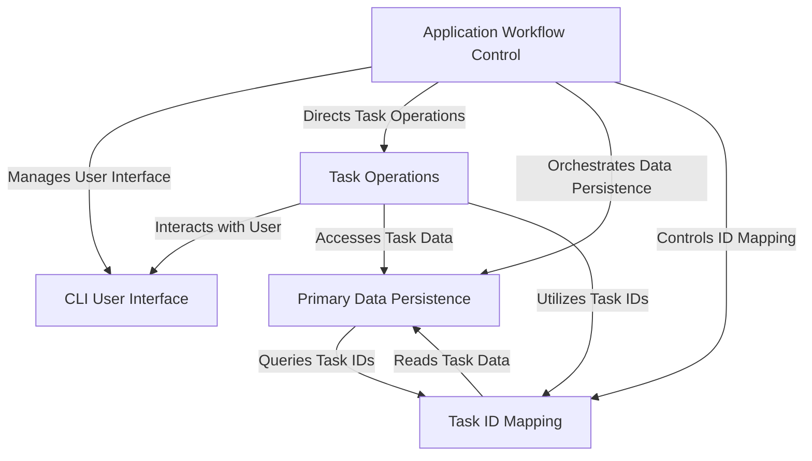
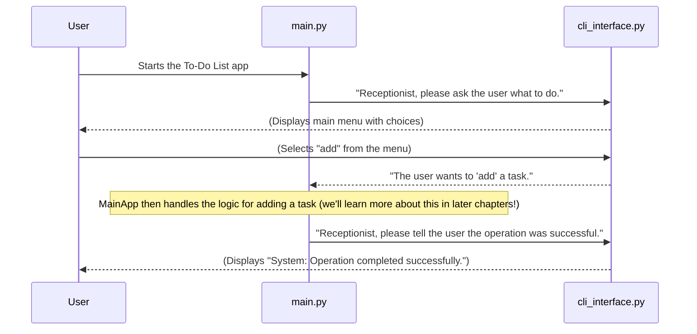
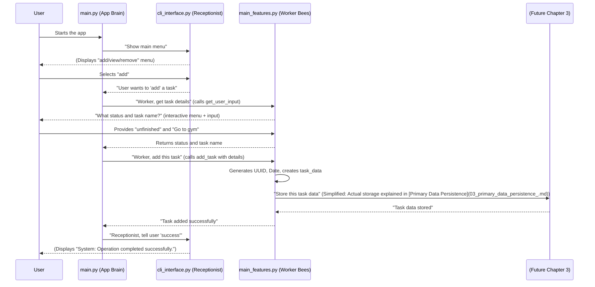
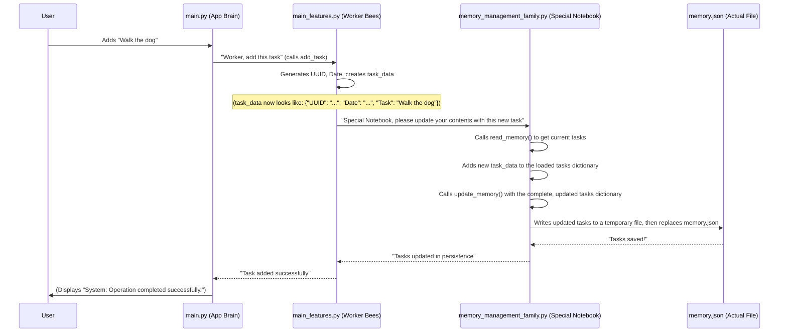
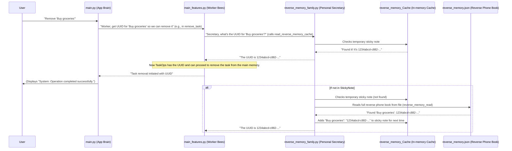

# Tutorial: Python-practice

This project is a **command-line to-do list application** that helps users *organize their tasks* effectively. It allows for easily **adding new tasks**, *viewing existing ones*, **removing completed items**, and *updating their status*. All tasks are **saved automatically** to a file, ensuring data persistence even after the program closes, making it a reliable tool for managing daily to-dos.


## Visual Overview



## Chapters

1. [CLI User Interface
2. [Task Operations
3. [Primary Data Persistence
4. [Task ID Mapping
5. [Application Workflow Control

---
# Chapter 1: CLI User Interface

Welcome to your journey into building a To-Do List application! Every good application needs a way to talk to its users. Think of our To-Do List app as a helpful assistant. How do you tell this assistant what you want to do, and how does it tell you if it's done something or if there was a problem?

This is where the **CLI User Interface** comes in! CLI stands for "Command Line Interface." It's like the friendly **receptionist** for our To-Do List app. Its main job is to handle all the conversations between you (the user) and the application, using only text in your terminal or command prompt. It makes sure you can easily tell the app what you want to do (like "add a task" or "view my tasks") and get clear feedback.

Our central use case for this chapter is simple: **How does the To-Do List application present you with options and understand which one you pick?** For example, when you first run the app, you need to see choices like "add," "view," or "exit."

Let's explore how our CLI User Interface (our "receptionist") handles this!

---

### Key Concept 1: Presenting Choices (The Main Menu)

Our receptionist needs to greet you and ask, "What would you like to do today?" In our application, this is handled by a special function that creates a menu you can interact with. It uses a helpful Python library called `questionary` to make these menus easy to use with arrow keys, rather than just typing.

Let's look at the core of how this main menu is created in our project. You'll find this code in `Project4todolist/cli_interface.py`:

```python
# Project4todolist/cli_interface.py (simplified)

import questionary
# We'll learn about 'Style' later, but it just makes the menu look nice.

def terminal_interface():
    # These are the actions our "receptionist" can help you with
    choices = ["add", "view", "remove", "update", "exit"]
    
    # This creates an interactive menu for the user
    user_choices = questionary.select(
        "(Arrow keys are utilised throughout the cli)", # The question displayed
        choices=choices,                               # The list of options
        # style=custom_style                           # (We'll skip styling details for now)
    )
    user_input = user_choices.ask() # This waits for you to pick an option
    return user_input               # The chosen option is returned
```

**What's happening here?**

This `terminal_interface()` function is like the main greeting from our receptionist. When the app calls this function, it shows you a list of things you can do: "add", "view", "remove", "update", or "exit". You can then use your keyboard's arrow keys to move up and down the list and press Enter to select your choice. The function then sends your choice back to the main part of the application.

For example, if you run the app and see the menu, you might do this:

1.  **App Displays**:
    ```
    (Arrow keys are utilised throughout the cli)
    ❯ add
      view
      remove
      update
      exit
    ```
2.  **You**: Use arrow keys to highlight "add", then press Enter.
3.  **App Receives**: The string `"add"` is returned, and the app knows you want to add a task!

---

### Key Concept 2: Giving Feedback (System Messages)

After you've told the app what to do, our receptionist also needs to give you feedback. Did your task add successfully? Was there an error? This is handled by **system messages**. Instead of the app just printing any old text, it has a standard way to deliver important information.

Here’s a simplified look at the `system_message()` function, also found in `Project4todolist/cli_interface.py`:

```python
# Project4todolist/cli_interface.py (simplified)

def system_message(message_keyword):
    # This is like a little dictionary of pre-written responses
    all_messages = {
        "error": "An error occurred. Please try again.",
        "duplicate": "The task already exists. Please add a different task.",
        "success": "Operation completed successfully.",
        "exit": "Exiting the todo list terminal interface."
    }
    print("\n System:") # We print a consistent header for all system messages
    # We look up the message using the keyword, or return a default if not found
    return all_messages.get(message_keyword.lower(), "Unknown system message.")
```

**What's happening here?**

The `system_message()` function acts like our receptionist pulling out a pre-written card to give you a clear, consistent response. When another part of the app needs to tell you something (like "success" or "error"), it just tells this function which "card" to read, and the function prints it out neatly.

For example, if you successfully add a task, another part of the app might call `system_message("success")`. You would then see:

```
 System:
Operation completed successfully.
```

---

### How It Works Together: The CLI Receptionist in Action

Let's put these pieces together. Imagine you're the user, and our `main.py` file is the central "brain" of the To-Do List application. `cli_interface.py` is our dedicated "receptionist."

Here's a simple sequence of how you might interact with the application:



This diagram shows how `main.py` (the brain) talks to `cli_interface.py` (the receptionist) to manage all interactions with you, the user.

Let's see a simplified example from `Project4todolist/main.py` to understand how it uses our `cli_interface` functions:

```python
# Project4todolist/main.py (simplified)

import cli_interface as cli # We import our CLI "receptionist" module

# This is the main loop where our app keeps running
while True:
    print("\n ----- Todo List Terminal Interface -----")
    # Step 1: Ask the user what they want to do
    user_input = cli.terminal_interface() # Calls our menu function

    # Step 2: Based on the user's choice, decide what to do
    if user_input == 'exit':
        print(cli.system_message("exit")) # Use receptionist to print exit message
        break # Stop the application loop
    elif user_input == 'add':
        # ... Imagine code here that gets task details and adds them ...
        # Step 3: Give feedback to the user
        success_message = cli.system_message("success") # Get success message
        print(success_message) # Print it to the user
    # ... other choices like 'view', 'remove' would also use cli functions ...
    elif user_input is None: # This happens if the user presses Ctrl+C
        print(cli.system_message("exit"))
        break
```

**Putting it all together in `main.py`:**

This snippet from `main.py` demonstrates how the central part of our application (the `while True:` loop) repeatedly calls our `cli_interface` receptionist.

1.  It first calls `cli.terminal_interface()` to show you the main menu and get your choice (like "add" or "exit").
2.  Then, it checks what you chose.
3.  If you chose "exit", it asks the receptionist (`cli.system_message("exit")`) to give you a polite goodbye message.
4.  If you chose "add" (and after the task is handled), it again asks the receptionist (`cli.system_message("success")`) to tell you that the operation was successful.

This way, `cli_interface.py` provides a consistent and user-friendly way for you to command the application and receive messages back.

---

### Conclusion

In this first chapter, you've learned that the **CLI User Interface** (handled by `cli_interface.py`) is like the friendly receptionist for our To-Do List application. It's responsible for all the "talking" with you, the user, through the command line.

You saw how it:
*   Presents a clear menu of options using `terminal_interface()`.
*   Delivers consistent feedback and important messages using `system_message()`.

By using these functions, our application can easily ask you what you want to do and tell you what's happening, making for a smooth user experience.
---
# Chapter 2: Task Operations

Welcome back! In [Chapter 1: CLI User Interface](01_cli_user_interface_.md), we learned how our To-Do List app talks to you, the user. We saw how the `cli_interface.py` module acts like a friendly **receptionist**, presenting menus and giving you feedback. But what happens *after* you tell the receptionist you want to "add" a task or "view" your tasks?

This is where **Task Operations** comes in! Think of Task Operations as the **"worker bees"** or the **"action center"** of our To-Do List application. While the receptionist (`cli_interface.py`) takes your order, the worker bees (`main_features.py`) actually *do* the work: they add the task to your list, find tasks to show you, or remove a task you've finished.

Our central use case for this chapter is: **How does the To-Do List application actually add a new task after you've chosen "add" from the menu?**

Let's explore how our Task Operations (our "worker bees") handle this!

---

### Key Concept 1: Getting Specific Task Details

After you tell the main app that you want to "add" a task (via the [CLI User Interface](01_cli_user_interface_.md) menu), the app needs to ask *more* specific questions. What's the task called? What status should it have (like "pending" or "unfinished")?

This job is handled by a special function in `Project4todolist/main_features.py` called `get_user_input()`. It's like the worker bee asking for the details of your new task.

Let's look at a simplified version of this function:

```python
# Project4todolist/main_features.py (simplified)
import questionary # Used to make interactive menus

def get_user_input():
    # Imagine 'status' here holds a list of possible statuses like "finished", "unfinished"
    # We'll learn how these statuses are managed in later chapters!

    # Ask the user to choose a status for the new task
    status_choices = questionary.select(
        "Select a status:",
        choices=["finished", "unfinished", "pending"] # Example choices
    )
    status_input = status_choices.ask() # Wait for the user to pick one

    if status_input is None: # If user cancels (e.g., Ctrl+C)
        print("\n System: \n Exiting add task.")
        return None, None # Return nothing
    
    # Ask the user to type the actual task description
    task_input = input("Input task ")

    if not task_input: # If the user just presses Enter without typing anything
        print("\n System: \n Task cannot be empty.")
        return None, None
    else:
        return status_input, task_input # Return both the chosen status and the task text
```

**What's happening here?**

The `get_user_input()` function is specifically designed to collect the necessary information *for a new task*. It uses `questionary` again (just like the [CLI User Interface](01_cli_user_interface_.md) main menu) to let you pick a status with arrow keys, and then uses a simple `input()` for you to type the task's name. It then sends these two pieces of information (status and task name) back to the main part of the app.

**Example Interaction:**

1.  **App Displays**:
    ```
    Select a status:
    ❯ finished
      unfinished
      pending
    ```
2.  **You**: Use arrow keys to highlight "unfinished", then press Enter.
3.  **App Displays**:
    ```
    Input task
    ```
4.  **You**: Type `Go to the gym` and press Enter.
5.  **App Receives**: The function returns `("unfinished", "Go to the gym")`.

---

### Key Concept 2: Performing the "Add Task" Action

Once the app has the task's status and name, the core "worker bee" function, `add_task()`, takes over. This function is responsible for creating a new task entry and preparing it to be saved.

Here's a simplified look at the `add_task()` function, also from `Project4todolist/main_features.py`:

```python
# Project4todolist/main_features.py (simplified)
import uuid # Used to create unique IDs
from datetime import datetime # Used to get the current date and time
# We'll learn about memory_management_family and reverse_memory_family in later chapters!

def add_task(status_chosen, task_text):
    # 1. Generate a unique ID for this new task
    unique_id = str(uuid.uuid4()) 
    
    # 2. Get the current date and time
    current_date = datetime.now().strftime("%Y-%m-%d %H:%M:%S")

    # 3. Combine all task details into a dictionary (a structured piece of data)
    task_data = {
        "UUID": unique_id,
        "Date": current_date,
        "Task": task_text
    }
    
    # --- IMPORTANT NOTE ---
    # In the actual code, there are more steps here to save this 'task_data'
    # into our application's "memory" (storage). We'll learn all about how
    # this data is stored and kept safe in Chapter 3: Primary Data Persistence!
    # For now, just know that this 'task_data' is ready to be stored.

    print(f"Task '{task_text}' (ID: {unique_id}) prepared for '{status_chosen}' list.")
    # The real app would then store this and use the CLI to say "success!"
```

**What's happening here?**

The `add_task()` function takes the `status_chosen` (e.g., "unfinished") and `task_text` (e.g., "Go to the gym") that we got from `get_user_input()`. It then does two very important things:

1.  **Generates a Unique ID (UUID):** Imagine every task needs its own special, unique fingerprint so we can always tell it apart from other tasks, even if they have the same name. `uuid.uuid4()` creates a long, unique code for this.
2.  **Records the Current Date/Time:** It automatically adds a timestamp, so we know when the task was added.
3.  **Packages Task Data:** It collects the UUID, date, and task text into a neat "package" called a dictionary (`task_data`). This structured data is then ready to be stored.

Notice the `--- IMPORTANT NOTE ---` in the code. The `add_task` function prepares the data, but the actual *saving* of this data is handled by other parts of the system, which we'll cover in the next chapter!

---

### How Task Operations Work Together: Adding a Task

Let's put together how the CLI Receptionist and the Task Operations Worker Bees collaborate to add a task.



This diagram shows the journey of adding a task. The `main.py` acts as the "brain," telling `cli_interface.py` to get user choices, and then telling `main_features.py` (our Task Operations) to perform the actual work.

You can see this flow in action in `Project4todolist/main.py`:

```python
# Project4todolist/main.py (simplified)

import cli_interface as cli # Our Receptionist
import main_features as main # Our Worker Bees (Task Operations)

while True: # Keep the app running
    print("\n ----- Todo List Terminal Interface -----")
    user_input = cli.terminal_interface() # Ask user what to do

    if user_input == 'exit':
        print(cli.system_message("exit"))
        break
    elif user_input == 'add':
        # Step 1: Get task details from the user using Task Operations
        status_input, task_input = main.get_user_input() 
        
        # Check if the user actually provided input (didn't cancel or leave empty)
        if status_input and task_input:
            # Step 2: Perform the 'add task' action using Task Operations
            main.add_task(status_input, task_input) 
            
            # Step 3: Use the CLI Receptionist to tell the user it was successful
            print(cli.system_message("success")) 
        else:
            # If get_user_input returned None, it means user cancelled or input was invalid
            print("Task addition cancelled or invalid input.")
    # ... other choices like 'view', 'remove' would also use main_features functions ...
```

**Putting it all together in `main.py`:**

This snippet from `main.py` shows how the central application "brain" coordinates. After getting `user_input` from the `cli_interface` (our receptionist), if the user picked `'add'`:
1.  It calls `main.get_user_input()` (from Task Operations) to get the specific details for the new task.
2.  Then, it calls `main.add_task()` (from Task Operations) to actually create and prepare the task data.
3.  Finally, it calls `cli.system_message("success")` (from our receptionist) to tell you that the task was successfully processed!

---

### Other Task Operations

While we focused on `add_task` to understand the core concept, `main_features.py` contains other important "worker bee" functions:

| Task Operation Function | What it does                                                                                                                                                                                                                                                                             |
| :---------------------- | :--------------------------------------------------------------------------------------------------------------------------------------------------------------------------------------------------------------------------------------------------------------------------------------- |
| `add_task()`            | Creates a new task entry with a unique ID and timestamp, then prepares it for storage.                                                                                                                                                                                                   |
| `view_tasks()`          | Retrieves existing tasks from storage and presents them to the user (e.g., "Show me all my 'unfinished' tasks").                                                                                                                                                                        |
| `remove_task()`         | Finds a specific task by its name (and often its unique ID) and removes it from storage.                                                                                                                                                                                                 |
| `update_task()`         | Finds a specific task and changes its properties, for example, moving a task from "unfinished" to "finished" status.                                                                                                                                                                     |
| `check_task_exists()`   | A helper function used *before* adding a task to make sure you're not adding the exact same task twice. This prevents duplicates in your list.                                                                                                                                            |

These functions are all located in `Project4todolist/main_features.py` and collectively form the "Task Operations" component of our application. They are the heart of what makes our To-Do List actually *do* things with your tasks.

---

### Conclusion

In this chapter, you've learned that **Task Operations** (handled by `main_features.py`) are the "worker bees" of our To-Do List application. They are responsible for performing all the actual work on your tasks.

You saw how:
*   `get_user_input()` asks for specific task details like status and name.
*   `add_task()` creates a new task with a unique ID and timestamp, ready to be saved.
*   The main application coordinates between the [CLI User Interface](01_cli_user_interface_.md) (receptionist) and Task Operations (worker bees) to fulfill your commands.

Now that we understand how tasks are created and processed, the next crucial step is to learn *where* these tasks are stored so they don't disappear when the application closes. That's what we'll explore in the next chapter!

[Next Chapter: Primary Data Persistence]
---

# Chapter 3: Primary Data Persistence

Welcome back! In [Chapter 1: CLI User Interface](01_cli_user_interface_.md), you learned how our To-Do List app talks to you, the user. Then, in [Chapter 2: Task Operations](02_task_operations_.md), we explored how the app actually *performs* actions like adding a task. We saw how `add_task()` creates a new task with a unique ID and a timestamp, packaging it neatly into a dictionary.

But there's a big question: What happens to all your carefully added tasks when you close the application? Do they just vanish into thin air? If so, our To-Do List wouldn't be very useful!

This is where **Primary Data Persistence** comes in! Think of Primary Data Persistence as the **application's long-term memory or its special notebook**. Its main job is to make sure that everything you do in the app—adding tasks, marking them finished, removing them—is saved to a file on your computer. This way, when you open the app again, all your tasks are right there, exactly as you left them. It's how your To-Do List "remembers" everything between sessions.

Our central use case for this chapter is: **How does our To-Do List application remember all your tasks even after you close it and reopen it?**

Let's explore how our "special notebook" handles this!

---

### Key Concept 1: The Data File (`memory.json`)

To remember your tasks, our application needs a place to store them. We use a special type of text file called a **JSON file**. JSON stands for JavaScript Object Notation, and it's a very common way to store structured data that both humans and computers can easily read. Think of it like a neatly organized digital notebook.

In our project, this "notebook" is called `memory.json` and it lives in a folder called `memory`.

Here's a tiny peek at what `memory.json` might look like:

```json
# Project4todolist/memory/memory.json (simplified)
{
    "finished": {
        "1234abcd-c882-...": {
            "UUID": "1234abcd-c882-...",
            "Date": "2023-10-27 10:00:00",
            "Task": "Buy groceries"
        }
    },
    "pending": {
        "5678efgh-754e-...": {
            "UUID": "5678efgh-754e-...",
            "Date": "2023-10-27 11:30:00",
            "Task": "Call Mom"
        }
    },
    "unfinished": {}
}
```

**What's happening here?**

*   **Curly Braces `{}`:** These mean it's an "object" or a "dictionary" in programming terms. It holds a collection of information.
*   **"finished", "pending", "unfinished":** These are the different categories (statuses) for your tasks. Each category is like a section in your notebook.
*   **"1234abcd-c882-..." (UUID):** This is the unique ID we learned about in [Chapter 2: Task Operations](02_task_operations_.md). Each task gets its own unique ID, which acts as a key to find that specific task within its category.
*   **"Task": "Buy groceries", "Date": "2023-10-27..."**: These are the actual details of your task, stored neatly.

This JSON file holds all your tasks, organized by their status.

---

### Key Concept 2: Finding Our Special Notebook (`get_memory_path`)

Before we can read from or write to `memory.json`, our application needs to know exactly where to find it on your computer. Imagine you have a special notebook, but you often move it around. You need a reliable way to always find it, no matter where you are when you look for it!

The function `get_memory_path()` in `Project4todolist/memory_management_family.py` acts like a clever detective that always finds the exact "street address" of our `memory.json` file.

```python
# Project4todolist/memory_management_family.py (simplified)
import os # Helps with file paths

def get_memory_path(filename):
    # Find the folder where the app's code is running
    script_directory = os.path.dirname(os.path.abspath(__file__))
    
    # Combine that folder with "memory" and the filename to get the full path
    file_path = os.path.join(script_directory, "memory", filename)
    return file_path
```

**What's happening here?**

This function figures out the current location of the Python script it's running from, then reliably constructs the full path to `memory.json` (inside the `memory` folder). This ensures that no matter where you run the To-Do List application from, it will always locate its data file.

---

### Key Concept 3: Loading Tasks (Reading Our Notebook)

When you start the To-Do List application, the first thing it needs to do is open its "special notebook" (`memory.json`) and load all your tasks into its active memory. This is handled by the `read_memory()` function.

```python
# Project4todolist/memory_management_family.py (simplified)
import json # Library for working with JSON files

def read_memory():
    json_path = get_memory_path("memory.json") # Get the file's location
    
    try:
        with open(json_path, "r") as file: # Open the file in "read" mode ('r')
            # Check if the file is empty or has issues
            content = file.read()
            if not content:
                print("\n System: \n - Memory file is empty, starting fresh.")
                return {"finished":{}, "pending":{}, "unfinished":{}}, "empty"
            
            file.seek(0) # Reset the file 'cursor' to the beginning
            status_data = json.load(file) # Load the JSON data into a Python dictionary
            return status_data, "found"
            
    except (FileNotFoundError, json.JSONDecodeError):
        # If the file doesn't exist or is broken, start with an empty notebook
        print("\n System: \n - Memory file not found/error, creating new one.")
        return {"finished":{}, "pending":{}, "unfinished":{}}, "error"
```

**What's happening here?**

1.  **Find the File**: It first uses `get_memory_path()` (our clever detective) to find `memory.json`.
2.  **Open and Read**: It then uses `open(json_path, "r")` to open the file. The `"r"` means "read mode," so it only reads the contents.
3.  **Handle Empty/Missing File**: It checks if the file is empty or if it doesn't exist at all. If so, it creates a brand new, empty "notebook" structure so the app can still run without errors.
4.  **Load JSON Data**: If the file exists and has content, `json.load(file)` takes the text from the JSON file and turns it into a Python dictionary. This dictionary then holds all your tasks in a format the app can work with.
5.  **Return Data**: The function returns this dictionary, ready for the app to use.

---

### Key Concept 4: Saving Changes (Writing in Our Notebook)

After you add a new task, update one, or remove one, the application needs to save these changes back to `memory.json`. If it didn't, the changes would be lost when you close the app! This is like carefully writing down new entries or crossing out old ones in your physical notebook.

The `update_memory()` function is responsible for this critical job. It makes sure your changes are saved safely.

```python
# Project4todolist/memory_management_family.py (simplified)
import os
import json

def update_memory(data_to_save):
    json_path = get_memory_path("memory.json") # Get the file's location
    temp_path = json_path + ".tmp" # Create a temporary file name

    # 1. Write ALL the data to a temporary file first
    with open(temp_path, "w") as temp_file:
        json.dump(data_to_save, temp_file, indent=4) # Write the Python dictionary as JSON

    # 2. Replace the original file with the temporary one (safely!)
    try:
        os.replace(temp_path, json_path)
    except PermissionError:
        print("\n System:\n - Permission error when saving tasks.\n")
```

**What's happening here?**

1.  **Temporary File**: Instead of writing directly to `memory.json`, the app first writes all the updated task data to a *temporary file* (like `memory.json.tmp`). This is a safety measure.
2.  **`json.dump()`**: This function takes the Python dictionary (`data_to_save`) that holds all your tasks and converts it back into JSON text, then writes it into the `temp_file`. `indent=4` just makes the JSON file look nice and readable.
3.  **Atomic Write (`os.replace`)**: Once the temporary file is perfectly written, `os.replace()` quickly swaps the old `memory.json` with the new `memory.json.tmp`. This is called an "atomic write," meaning it either completely succeeds (your data is saved) or completely fails (your old data is untouched), preventing a corrupted file if something goes wrong during saving (like a power outage).
4.  **Error Handling**: If there's a problem (e.g., your computer blocks writing to the file), it prints a message.

---

### How It Works Together: Saving a New Task for Good!

Let's revisit our "add task" example from [Chapter 2: Task Operations](02_task_operations_.md) and see how Primary Data Persistence fits in.



This diagram shows that when `main_features.py` (our Task Operations "worker bee") adds a task, it doesn't just create the data; it also coordinates with `memory_management_family.py` (our "Special Notebook") to make sure that new task is written down permanently in `memory.json`.

You can see this flow in action in `Project4todolist/main.py`:

```python
# Project4todolist/main.py (simplified)

import cli_interface as cli
import main_features as main
import memory_management_family as persistence # Our Special Notebook module

# ... (rest of the main.py file) ...

while True:
    # ... (code to show menu and get user input) ...

    if user_input == 'add':
        status_input, task_input = main.get_user_input() 
        
        if status_input and task_input:
            # Here, main.add_task *internally* uses persistence functions
            # to add the task to the in-memory data, and then saves it.
            main.add_task(status_input, task_input) 
            
            print(cli.system_message("success"))
        else:
            print("Task addition cancelled or invalid input.")
    # ... (other choices) ...

    # The sanitise_function is called here to clean up duplicates
    persistence.sanitise_function() 
```

**Putting it all together in `main.py`:**

In `main.py`, after the user decides to "add" a task and provides the details:
1.  `main.get_user_input()` collects the task status and name.
2.  `main.add_task()` (from Task Operations) takes this information, creates the task data (UUID, date, task text), and then (importantly!) uses the functions from `memory_management_family.py` (our Primary Data Persistence) to save these changes to `memory.json`.
3.  Finally, `cli.system_message("success")` confirms to the user that the task was saved.

You'll also notice `persistence.sanitise_function()` is called. This is another important part of data persistence.

---

### Other Persistence Operations: Keeping the Notebook Tidy (`sanitise_function`)

Our "special notebook" isn't just about reading and writing; it also has a "tidiness manager" called `sanitise_function()`. This function helps keep your task list clean and organized by automatically finding and removing duplicate tasks.

```python
# Project4todolist/memory_management_family.py (simplified)

def sanitise_function():
    status_data, _ = read_memory() # Load all tasks
    seen_tasks = set() # Keep track of tasks we've seen
    tasks_to_delete = [] # List of duplicates to remove

    for category in status_data:
        for task_uuid, task_details in status_data[category].items():
            task_name = task_details.get("Task").strip()
            if task_name in seen_tasks:
                print(f"\n System: \n - Found duplicate '{task_name}', deleting...\n")
                tasks_to_delete.append((task_uuid, category))
            else:
                seen_tasks.add(task_name)
    
    # After finding all duplicates, actually delete them
    for uuid_val, category_key in tasks_to_delete:
        del status_data[category_key][uuid_val]
    
    if tasks_to_delete: # Only update if duplicates were found
        update_memory(status_data) # Save the cleaned-up list
    else:
        print("\n System: \n - Stable (no duplicates found).\n")
```

**What's happening here?**

The `sanitise_function()` goes through all your tasks, across all categories. It checks if any two tasks have exactly the same name. If it finds duplicates, it notes them down, and then removes the extra copies, leaving only one unique task. Finally, it uses `update_memory()` to save this cleaned-up version back to `memory.json`. This ensures your task list stays organized and free from redundant entries.

---

### Conclusion

In this chapter, you've learned that **Primary Data Persistence** (managed by `memory_management_family.py` and `memory.json`) is how our To-Do List application remembers everything. It's the "long-term memory" that saves your tasks to a file, so they're always there when you need them.

You saw how it:
*   Uses `memory.json` as a structured digital notebook for tasks.
*   Reliably finds this notebook using `get_memory_path()`.
*   Loads all your tasks into the app's memory using `read_memory()`.
*   Safely saves all your changes back to the file using `update_memory()`.
*   Keeps your task list tidy by removing duplicate tasks with `sanitise_function()`.

With data persistence, our To-Do List application becomes truly useful, keeping track of your progress and plans over time. But sometimes, when we talk about tasks, we don't always use their long, unique IDs. We might refer to them by a shorter, friendlier number. How does the app connect these friendly numbers to the actual tasks? That's what we'll explore in the next chapter!

[Next Chapter: Task ID Mapping]

---


# Chapter 4: Task ID Mapping

Welcome back! In [Chapter 3: Primary Data Persistence](03_primary_data_persistence_.md), we learned how our To-Do List application "remembers" all your tasks by saving them in `memory.json`. Each task gets a long, unique identifier called a UUID (e.g., `1234abcd-c882-4118-9733-53f839fea457`).

UUIDs are fantastic for computers because they are guaranteed to be unique and prevent tasks from getting mixed up. But let's be honest, trying to remember or type a UUID like `1234abcd-c882-...` every time you want to remove or update a task would be a nightmare for a human!

This is where **Task ID Mapping** comes in! Think of Task ID Mapping as the **application's personal secretary who knows everyone by name, but can quickly find their official ID number**. Its main job is to translate a human-readable task name (like "Buy groceries") into its corresponding unique UUID. This makes it much easier for you to interact with the app. When you say "remove 'Buy groceries'", the secretary quickly looks up the UUID for "Buy groceries" and tells the app which specific task to delete. It even keeps a temporary "sticky note" with frequently requested IDs for extra fast lookups!

Our central use case for this chapter is: **How does the application efficiently find a task's unique ID (UUID) when a user refers to it by its name (e.g., to remove it)?**

Let's explore how our "personal secretary" handles this!

---

### Key Concept 1: The "Reverse Phone Book" (`reverse_memory.json`)

To quickly look up a task's UUID by its name, our application uses another special file, `reverse_memory.json`. You can think of this file as a **"reverse phone book"**. In a normal phone book, you look up a person's name to find their number. In our `reverse_memory.json`, you look up a task's *name* to find its *UUID*.

This file is also a JSON file (just like `memory.json`), making it easy for the computer to read. It lives in the same `memory` folder.

Here’s a tiny peek at what `reverse_memory.json` might look like:

```json
# Project4todolist/memory/reverse_memory.json (simplified)
{
    "Buy groceries": "1234abcd-c882-4118-9733-53f839fea457",
    "Call Mom": "5678efgh-754e-4043-b366-1f0b44c0f2a7",
    "Go to the gym": "9101ijkl-a1b2-c3d4-e5f6-7890abcdef12"
}
```

**What's happening here?**

*   Each entry in this file is a `key: value` pair.
*   The `key` is the `Task Name` (e.g., `"Buy groceries"`).
*   The `value` is the corresponding `UUID` (e.g., `"1234abcd-c882-..."`).
This way, if the app needs the UUID for "Buy groceries", it just looks it up here!

---

### Key Concept 2: Building the "Reverse Phone Book" (`initialise_reverse_map`)

How does this "reverse phone book" get created in the first place? It can't just magically appear! When the application starts, or if `reverse_memory.json` is missing/empty, our "personal secretary" needs to build it. It does this by going through all the tasks in our main "special notebook" (`memory.json`) and creating these `Task Name -> UUID` pairs.

The `initialise_reverse_map()` function in `Project4todolist/reverse_memory_family.py` handles this.

```python
# Project4todolist/reverse_memory_family.py (simplified)
import memory_management_family # We need to read the main memory!

def initialise_reverse_map():
    # 1. Read all tasks from the main memory (our special notebook)
    status_data, _ = memory_management_family.read_memory()
    reverse_dictionary = {} # This will be our new reverse map

    # 2. Go through each task and add it to our reverse dictionary
    for category in status_data.values(): # e.g., "finished", "pending"
        for task_details in category.values(): # Each actual task
            task_name = task_details.get("Task") # Get the task's name
            uuid_id = task_details.get("UUID")   # Get the task's UUID
            if uuid_id and task_name:
                # Add the name-to-UUID mapping to our dictionary
                reverse_dictionary[task_name] = uuid_id
                
    # 3. Save this newly built reverse dictionary to reverse_memory.json
    update_memory_reverse(reverse_dictionary) # (We'll see this function soon!)
    return reverse_dictionary
```

**What's happening here?**

This function effectively reads every single task from `memory.json`, extracts its name and its UUID, and then creates a new dictionary where the name points to the UUID. Finally, it saves this new mapping into `reverse_memory.json` using `update_memory_reverse()`.

---

### Key Concept 3: Fast Lookups with a Temporary Sticky Note (`reverse_memory_Cache`)

Even though reading `reverse_memory.json` is faster than looking at all tasks in `memory.json`, opening a file from your hard drive still takes a little bit of time. For operations that happen very frequently, our "personal secretary" keeps a temporary **"sticky note"** in its active memory. This is called a **cache**.

The `reverse_memory_Cache` is a global Python dictionary that stores the `Task Name -> UUID` mappings directly in the application's active memory. This means lookups are almost instant!

```python
# Project4todolist/reverse_memory_family.py (simplified)

# This is our global "sticky note" in the app's memory
reverse_memory_Cache = {} 

def initialise_reverse_memory_cache():
    global reverse_memory_Cache # Tell Python we want to use the global cache
    reverse_map = reverse_memory_read() # Read the full reverse map from file (if needed)
    # Copy all mappings from the file into our fast cache
    for task_name, uuid_id in reverse_map.items():
        reverse_memory_Cache[task_name] = uuid_id

def update_reverse_memory_cache(task_name, uuid_value):
    # When a new task is added, or a task name changes, update the sticky note!
    reverse_memory_Cache[task_name] = uuid_value
    # Note: The actual code would also update the reverse_memory.json file here
    # to make sure the change is saved permanently.
```

**What's happening here?**

*   `reverse_memory_Cache`: This is a simple Python dictionary that lives as long as the application is running.
*   `initialise_reverse_memory_cache()`: When the app starts, it reads all existing `Task Name -> UUID` pairs from `reverse_memory.json` (or builds it first if necessary) and puts them into this fast `reverse_memory_Cache`.
*   `update_reverse_memory_cache()`: If a new task is added, or an existing task's name changes, this function makes sure our "sticky note" is immediately updated so it's always accurate.

---

### Key Concept 4: Using the Mapping (`read_reverse_memory_cache`)

Now that we have our "reverse phone book" (both the permanent file and the temporary sticky note), how do we actually *use* it to find a UUID? It's as simple as asking our "personal secretary" to look it up!

The `read_reverse_memory_cache()` function provides the quickest way to get a UUID for a given task name.

```python
# Project4todolist/reverse_memory_family.py (simplified)

# (Assume reverse_memory_Cache is already initialised)

def read_reverse_memory_cache(task_name):
    # Look for the task's UUID directly in our fast "sticky note" cache
    uuid_found = reverse_memory_Cache.get(task_name)
    return uuid_found # Returns the UUID, or None if not found
```

**What's happening here?**

This function takes a `task_name` (like "Buy groceries") and checks if it exists in our `reverse_memory_Cache`. If it finds it, it immediately returns the corresponding UUID. If not, it returns `None`, indicating it couldn't find that task name in its current mappings.

---

### How It Works Together: Finding a Task's UUID by Name

Let's see how our "personal secretary" (Task ID Mapping) helps the app find a task's UUID when you want to perform an action like removing a task.



This diagram illustrates the quick lookup process. When `main_features.py` (our "worker bee") needs a UUID for a task name, it asks `reverse_memory_family.py` (our "personal secretary"). The secretary first checks its super-fast "sticky note" (the in-memory cache). If it's not there, it quickly looks in the `reverse_memory.json` file, updates the sticky note, and returns the UUID.

In `Project4todolist/main.py`, operations like `remove` or `update` would eventually call functions within `main_features.py`, which would then use these `reverse_memory_family` functions to get the necessary UUID.

---

### Other Task ID Mapping Operations

The `reverse_memory_family.py` module contains a few more important functions for managing our "reverse phone book":

| Function                          | What it does                                                                                                                                                                                                                                                                                                                                                                |
| :-------------------------------- | :-------------------------------------------------------------------------------------------------------------------------------------------------------------------------------------------------------------------------------------------------------------------------------------------------------------------------------------------------------------------------- |
| `initialise_reverse_map()`        | Creates or rebuilds the `Task Name -> UUID` mapping by scanning all tasks in `memory.json`, then saves this map to `reverse_memory.json`.                                                                                                                                                                                                                                      |
| `update_memory_reverse(data)`     | Safely writes the current `Task Name -> UUID` map to `reverse_memory.json`. It uses a temporary file and atomic replacement (like `update_memory()` in [Primary Data Persistence](03_primary_data_persistence_.md)) to prevent data corruption.                                                                                                                             |
| `reverse_memory_read()`           | Loads the complete `Task Name -> UUID` map from `reverse_memory.json` into a Python dictionary. It handles cases where the file is missing or corrupted by calling `initialise_reverse_map()`.                                                                                                                                                                                |
| `initialise_reverse_memory_cache()` | Fills the fast in-memory `reverse_memory_Cache` with all entries from `reverse_memory_read()`. This happens once when the application starts for quick lookups.                                                                                                                                                                                                               |
| `update_reverse_memory_cache(task, uuidvalue)` | Adds or updates a single `Task Name -> UUID` pair in the in-memory cache. This is used when a new task is added or a task's name is changed to keep the cache up-to-date.                                                                                                                                                                                               |
| `read_reverse_memory_cache(task)` | The primary function for getting a task's UUID given its name. It quickly checks the in-memory cache.                                                                                                                                                                                                                                                                       |

These functions work together to ensure that the application can always quickly find a task's unique ID, whether it's through the fast in-memory cache or by reading from the permanent `reverse_memory.json` file.

---

### Conclusion

In this chapter, you've learned that **Task ID Mapping** (handled by `reverse_memory_family.py` and `reverse_memory.json`) acts as the application's "personal secretary." It provides a crucial bridge between human-friendly task names and the machine-friendly unique UUIDs.

You saw how it:
*   Uses `reverse_memory.json` as a "reverse phone book" to store `Task Name -> UUID` mappings.
*   Builds this map by scanning `memory.json` using `initialise_reverse_map()`.
*   Uses `reverse_memory_Cache` as a super-fast, temporary "sticky note" for instant lookups.
*   Enables efficient translation of a task name into its UUID using `read_reverse_memory_cache()`.

With Task ID Mapping, our To-Do List application becomes much more user-friendly, allowing you to refer to tasks by their names without needing to worry about their complex internal IDs. Now that we understand all the individual pieces of our application, the next step is to see how they all come together and are orchestrated to make the entire application flow smoothly.

[Next Chapter: Application Workflow Control]

---

# Chapter 5: Application Workflow Control

Welcome back! In our previous chapters, we've built up all the essential parts of our To-Do List application:
*   [Chapter 1: CLI User Interface](01_cli_user_interface_.md) taught us how our app talks to you (the user) using menus and messages.
*   [Chapter 2: Task Operations](02_task_operations_.md) showed us how the app performs actions like adding or viewing tasks.
*   [Chapter 3: Primary Data Persistence](03_primary_data_persistence_.md) explained how our app remembers all your tasks by saving them to a file.
*   [Chapter 4: Task ID Mapping](04_task_id_mapping_.md) helped us understand how the app connects friendly task names to their unique internal IDs.

Now, imagine you have a well-organized team: a friendly receptionist, busy worker bees, a meticulous record-keeper, and a helpful personal secretary. Each knows their job. But who tells everyone what to do and when? Who makes sure the receptionist greets you *before* the worker starts a task?

This is where **Application Workflow Control** comes in! Think of it as the **"conductor"** of our entire To-Do List orchestra, or the **"main control panel"**. It's the central brain (`main.py`) that decides the overall flow: when to start, what to do based on your commands, and when to gracefully shut down. It ties all the other parts (CLI, Task Operations, Data Persistence, Task ID Mapping) together, making sure they work in harmony from the moment you launch the app until you close it.

Our central use case for this chapter is: **How does the To-Do List application start, continuously listen for user commands, execute the right action, and then shut down properly?**

Let's see how our "conductor" handles this!

---

### Key Concept 1: Getting Ready (Application Initialization)

Before our conductor can start directing the orchestra, all the instruments need to be tuned, and the sheet music needs to be laid out. Similarly, when our To-Do List application first starts, it needs to perform some setup tasks to ensure everything is ready.

This happens right at the beginning of our `Project4todolist/main.py` file, even before the app starts asking you for commands.

```python
# Project4todolist/main.py (simplified startup)

import cli_interface as cli
import memory_management_family as mem
import reverse_memory_family as rev
import main_features as main

# 1. Clean up tasks (e.g., remove duplicates from memory.json)
mem.sanitise_function() 

# 2. Build the task name-to-UUID map (if needed)
rev.initialise_reverse_map() 

# 3. Load the task name-to-UUID map into fast memory for quick lookups
rev.initialise_reverse_memory_cache() 

# ... the main loop will go here ...
```

**What's happening here?**

The conductor (our `main.py` file) first makes sure the stage is set:
1.  It calls `mem.sanitise_function()` from [Primary Data Persistence](03_primary_data_persistence_.md) to clean up any duplicate tasks in our `memory.json` file. This ensures a tidy list from the start.
2.  It then calls `rev.initialise_reverse_map()` from [Task ID Mapping](04_task_id_mapping_.md) to ensure that our "reverse phone book" (`reverse_memory.json`) is correctly built or updated.
3.  Finally, it calls `rev.initialise_reverse_memory_cache()` to load this "reverse phone book" into a super-fast in-memory "sticky note" so that task lookups are immediate.

These steps ensure that when you start using the app, all its data structures are consistent and ready for action.

---

### Key Concept 2: The Main Program Loop (Listening for Commands)

A helpful application doesn't just do one thing and then quit. It stays active, continuously waiting for your instructions. This is handled by a special programming construct called a **`while True:` loop**. Think of it as our conductor standing on the podium, ready to direct, constantly looking at the musicians (and the audience!) to see what's next.

```python
# Project4todolist/main.py (simplified main loop)

# ... (startup code from above) ...

while True: # This loop keeps the application running indefinitely
    print("\n ----- Todo List Terminal Interface -----"
          "\nYou can add tasks with 'add', view tasks with 'view', "
          "remove tasks with 'remove', update tasks with 'update' "
          "or exit with 'exit'.")
    
    # 1. Ask the user what they want to do
    user_input = cli.terminal_interface() 

    # 2. Based on the user's choice, decide what to do next
    # ... (command handling will go here) ...
```

**What's happening here?**

*   `while True:`: This line means "keep doing whatever is inside this loop, forever." This is how our application stays alive and responsive.
*   The `print` statements provide a welcoming banner and remind you of the available commands.
*   `user_input = cli.terminal_interface()`: This is a crucial line. Our conductor tells the [CLI User Interface](01_cli_user_interface_.md) (the "receptionist") to display the main menu and wait for you to make a choice. The selected option (like "add" or "exit") is then stored in the `user_input` variable.

This loop ensures that after one command is executed, the application immediately goes back to asking for the next command, providing a continuous experience.

---

### Key Concept 3: Interpreting Commands and Directing Traffic

Once the conductor receives your command (via `user_input`), it needs to decide which part of the orchestra should play. This is done using `if`, `elif` (else if), and `else` statements. Each choice you make (like "add", "view", "remove", "update", or "exit") corresponds to a different set of actions the conductor needs to orchestrate.

Let's look at how our conductor directs traffic for the "add" and "exit" commands:

```python
# Project4todolist/main.py (simplified command handling)

# ... (startup and main loop opening from above) ...

    # 1. Ask the user what they want to do
    user_input = cli.terminal_interface() 

    # 2. Based on the user's choice, decide what to do next
    if user_input == 'exit':
        print("Exiting the todo list terminal interface.")
        # Ensure the reverse map cache is saved to file before exiting
        rev.update_memory_reverse(rev.reverse_memory_Cache)
        break # Exit the 'while True' loop, shutting down the application
    
    elif user_input == 'add':
        try:
            # Tell Task Operations to get task details from user
            status_input, task_input = main.get_user_input() 
            
            if main.check_task_exists(task_input.strip()) == "Duplicate":
                # Use CLI for system message
                print(cli.system_message("error")) 
                print(f"\n System:\n - The task '{task_input}' already exists.\n")
                continue # Go back to the beginning of the while loop
            else:
                # Tell Task Operations to add the task
                main.add_task(status_input, task_input) 
                print(cli.system_message("success")) # Use CLI for success message
        except Exception as e:
            print(f"\n... an error occurred: {e}")
            print(cli.system_message("error"))
    
    # elif user_input == 'view':
    #     main.view_tasks() # Call Task Operations to view tasks
    # elif user_input == 'remove':
    #     main.remove_task() # Call Task Operations to remove a task
    # elif user_input == "update":
    #     main.update_task() # Call Task Operations to update a task
    
    elif user_input is None: # This handles if the user presses Ctrl+C
        print("Exiting the todo list terminal interface.")
        rev.update_memory_reverse(rev.reverse_memory_Cache)
        break # Exit the loop
```

**What's happening here?**

This is the core of our "conductor's" job:
*   **`if user_input == 'exit':`**: If you choose "exit", the conductor prints a goodbye message, makes sure the [Task ID Mapping](04_task_id_mapping_.md) cache is saved, and then `break`s out of the `while True` loop, stopping the application.
*   **`elif user_input == 'add':`**: If you choose "add":
    *   The conductor calls `main.get_user_input()` (from [Task Operations](02_task_operations_.md)) to get the task details (status and name).
    *   It checks for duplicates using `main.check_task_exists()`.
    *   If no duplicate, it calls `main.add_task()` (from [Task Operations](02_task_operations_.md)) to create and save the new task.
    *   Finally, it calls `cli.system_message("success")` (from [CLI User Interface](01_cli_user_interface_.md)) to tell you the task was added.
*   Other `elif` blocks (like for "view", "remove", "update") would similarly call the appropriate functions from `main_features.py` (our [Task Operations](02_task_operations_.md) module) to perform those actions, then use `cli_interface.py` to give you feedback.
*   `elif user_input is None:`: This is a robust way to handle if you press `Ctrl+C` to unexpectedly close the application. It still tries to save the `reverse_memory_Cache` and exits gracefully.

This structured decision-making process is how the application workflow is controlled, ensuring the right components are engaged at the right time.

---

### How It Works Together: A Full Application Cycle

Let's put all these pieces together and see how our `main.py` "conductor" orchestrates a complete journey from starting the app, adding a task, and then exiting.

```mermaid
sequenceDiagram
    participant User
    participant MainApp as main.py (The Conductor)
    participant Persistence as memory_management_family.py (Record-Keeper)
    participant IDMapping as reverse_memory_family.py (Secretary)
    participant CLI as cli_interface.py (Receptionist)
    participant TaskOps as main_features.py (Worker Bees)

    User->>MainApp: Starts the To-Do List app
    MainApp->>Persistence: "Record-Keeper, tidy up the main tasks!" (sanitise_function)
    Persistence-->>MainApp: "Tasks cleaned."
    MainApp->>IDMapping: "Secretary, make sure the name-to-ID map is ready!" (initialise_reverse_map)
    IDMapping-->>MainApp: "Map built."
    MainApp->>IDMapping: "Secretary, load the fast sticky note!" (initialise_reverse_memory_cache)
    IDMapping-->>MainApp: "Sticky note ready."

    loop Application Running Loop
        MainApp->>CLI: "Receptionist, show menu and ask user for command." (terminal_interface)
        CLI-->>User: (Displays menu: add, view, exit...)
        User->>CLI: Selects "add"
        CLI-->>MainApp: "User wants to 'add' a task."

        MainApp->>TaskOps: "Worker, get task details!" (get_user_input)
        TaskOps-->>User: (Prompts for status and task name)
        User->>TaskOps: Provides "unfinished" and "Go to the gym"
        TaskOps-->>MainApp: Returns status and task name.

        MainApp->>TaskOps: "Worker, check for duplicates for 'Go to the gym'!" (check_task_exists)
        TaskOps-->>MainApp: "No duplicate."

        MainApp->>TaskOps: "Worker, add 'Go to the gym'!" (add_task)
        Note over TaskOps: (add_task uses Persistence to save the new task, and IDMapping to update its cache)
        TaskOps-->>MainApp: "Task added successfully."
        MainApp->>CLI: "Receptionist, tell user it was a success!" (system_message("success"))
        CLI-->>User: (Displays "System: Operation completed successfully.")

        MainApp->>CLI: "Receptionist, show menu and ask user for command." (terminal_interface)
        User->>CLI: Selects "exit"
        CLI-->>MainApp: "User wants to 'exit'."
        
        MainApp->>IDMapping: "Secretary, save the sticky note to file!" (update_memory_reverse)
        IDMapping-->>MainApp: "Sticky note saved."
        MainApp->>User: "Exiting the todo list terminal interface."
        deactivate MainApp
    end
```

This sequence diagram illustrates the complete workflow controlled by `main.py`. It starts with initialization, then enters a continuous loop where it delegates tasks to other modules based on user input, and finally performs cleanup before exiting.

Here's the full, simplified `main.py` code, showing how all the pieces connect:

```python
# Project4todolist/main.py (Complete Simplified View)

import cli_interface as cli # Our Receptionist
import memory_management_family as mem # Our Record-Keeper
import reverse_memory_family as rev # Our Secretary
import main_features as main # Our Worker Bees

# --- Application Initialization (Setting the stage) ---
mem.sanitise_function() # Clean up our task memory
rev.initialise_reverse_map() # Build task name-to-ID map
rev.initialise_reverse_memory_cache() # Load map into fast memory

# --- Main Program Loop (The Conductor's continuous job) ---
while True:
    print("\n ----- Todo List Terminal Interface -----"
          "\nYou can add tasks with 'add', view tasks with 'view', "
          "remove tasks with 'remove', update tasks with 'update' "
          "or exit with 'exit'.")
    
    # Get user command from the CLI Receptionist
    user_input = cli.terminal_interface() 
    
    # --- Interpreting Commands and Directing Traffic ---
    if user_input == 'exit':
        print("Exiting the todo list terminal interface.")
        rev.update_memory_reverse(rev.reverse_memory_Cache) # Save cache
        break # Stop the application loop
    
    elif user_input == 'add':
        try:
            status_input, task_input = main.get_user_input() # Get task details
            
            if main.check_task_exists(task_input.strip()) == "Duplicate":
                print(cli.system_message("error"))
                print(f"\n System:\n - The task '{task_input}' already exists.\n")
                continue # Go back to start of loop for next command
            else:
                main.add_task(status_input, task_input) # Add the task
                print(cli.system_message("success")) # Confirm success
        except Exception as e:
            print(f"\n... an error occurred: {e}")
            print(cli.system_message("error"))
            
    elif user_input == 'view':
        main.view_tasks() # Show all tasks
    
    elif user_input == 'remove':
        main.remove_task() # Remove a task
    
    elif user_input == "update":
        main.update_task() # Update a task
    
    elif user_input is None: # User pressed Ctrl+C
        print("Exiting the todo list terminal interface.")
        rev.update_memory_reverse(rev.reverse_memory_Cache)
        break # Exit the loop

# --- Final Cleanup (After the loop ends) ---
# This ensures final tidiness if the app exits normally or via Ctrl+C
mem.sanitise_function() 
```

**Putting it all together in `main.py`:**

This comprehensive view of `main.py` demonstrates how it orchestrates the entire application. It first initializes all necessary components, then enters a continuous loop to interact with the user, and finally directs specific commands to the appropriate "worker" modules. It's the central hub that keeps everything running smoothly.

---

### Conclusion

In this final chapter, you've learned that **Application Workflow Control** (primarily managed by `main.py`) is the "conductor" or "main control panel" of our To-Do List application. It's responsible for the overall flow and harmony of the entire system.

You saw how it:
*   **Initializes** the application by setting up data structures and cleaning up previous sessions.
*   Maintains a **continuous loop** (`while True:`) to always be ready for user commands.
*   **Interprets user input** and directs the appropriate actions to other modules:
    *   `cli_interface.py` for user interaction and feedback.
    *   `main_features.py` for performing task operations (add, view, remove, update).
    *   `memory_management_family.py` for data persistence.
    *   `reverse_memory_family.py` for task ID mapping.
*   Ensures a **graceful exit** by saving important data before stopping.

By understanding how `main.py` orchestrates these different components, you now have a complete picture of how the To-Do List application works from startup to shutdown. Congratulations on completing this tutorial! You've successfully explored the core concepts behind building a functional and user-friendly command-line To-Do List application.

---

<sub><sup>Generated by [AI Codebase Knowledge Builder](https://github.com/The-Pocket/Tutorial-Codebase-Knowledge).</sup></sub> <sub><sup>**References**: [[1]](https://github.com/Fido213/Python-practice/blob/20bb51707559af5d7f0c61b127c7e8ff191a57d7/Project4todolist/main.py)</sup></sub>
